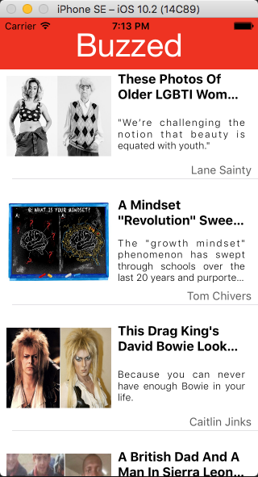
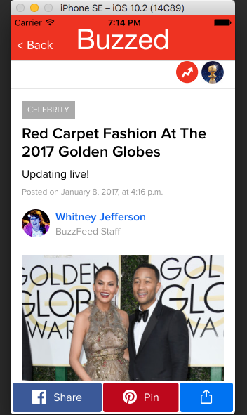

# Buzzed

1) Gathers data from different news sourse API's 
2) Stacks news links in home page 
3) Displays full page view of selected articles 
4) Enables social media sharing if allowed by article source 

